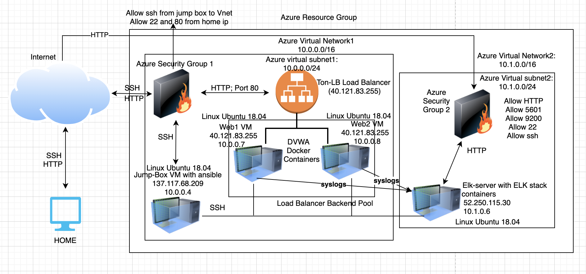
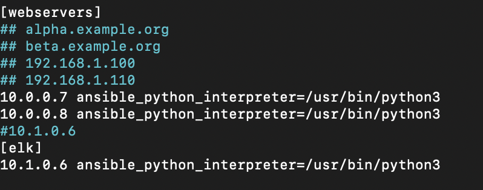
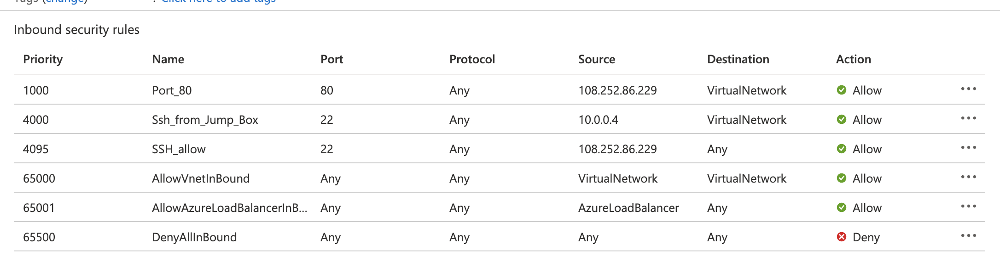
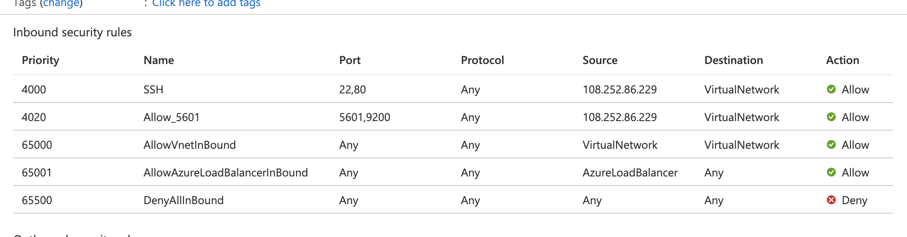
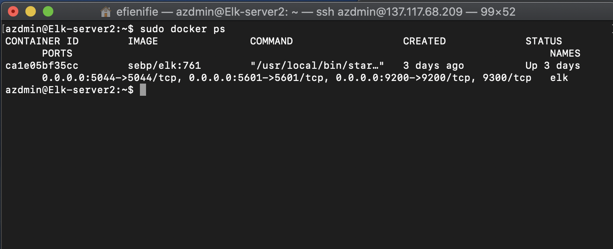
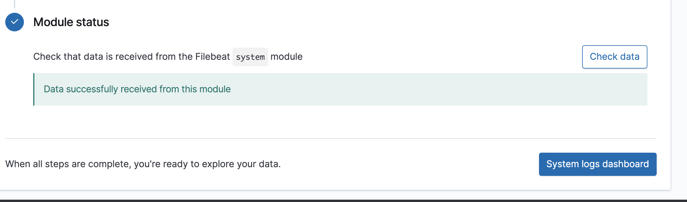
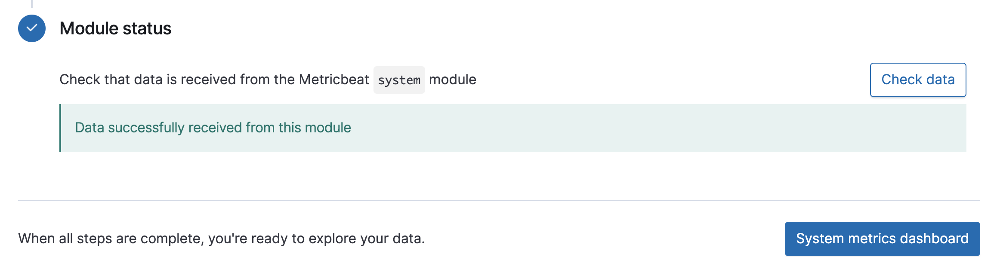
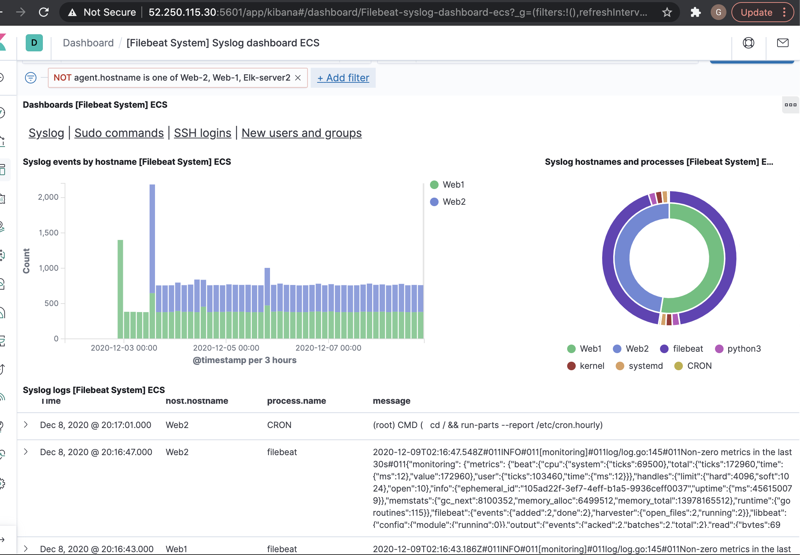

 The files in this repository can be used to configure the Virtual Resource Group depicted below.
 
 

These files have been tested and used to generate a live ELK deployment on Azure. They can be used to either recreate the entire deployment pictured above or select portions of the .yml file may be used to install only certain pieces of it, such as Filebeat.
 
- The following two playbook files were used for the ELK project;
- Install_elk.yml and filebeat-playbook.yml
 
This document contains the following details:
- Description of the Topology
- Access Policies
- ELK Configuration
 - Beats in Use
 - Machines Being Monitored
- How to Use the Ansible Build
 
 
### Description of the Topology
 
The main purpose of this network is to expose a load-balanced and monitored instance of DVWA, the D*mn Vulnerable Web Application.
 
Load balancing ensures that the application will be highly available, in addition to restricting access to the network.

The aspect of security that load balancers protect is Availability.

The jump box is advantageous beacuse it is used as a SAW (Secured Admin Station) and provides an extra layer of security for running administrative tasks. 
 
Integrating an ELK server allows users to easily monitor the vulnerable VMs for changes to the logs and system traffic.
- Filebeat watches for log files/events/location on the web Vms and forwards them to Elasticsearch or Logstash.
- Metricbeat records metric and statistical data generated from the operating system and other services that are running on the web VMs. 
 
 
The configuration details of each machine may be found below.
 
| Name     | Function | IP Address | Operating System |
|----------|----------|------------|------------------|
| Jump Box | Ansible  | 10.0.0.4   |Linux(Ubuntu 18.04)|
| Web1     |Docker-DVWA| 10.0.0.7  |Linux(Ubuntu 18.04)|
| Web2     |Docker-DVWA| 10.0.0.8  |Linux(Ubuntu 18.04)|
|Elk-server2|Docker-ELK| 10.1.0.6  |Linux(Ubuntu 18.04)|
 
### Access Policies
 
The machines on the internal network are not exposed to the public Internet.
 
Only the Jump Box machine can accept connections from the Internet. Access to this machine is only allowed from the following IP addresses: Personal IP
 
Machines within the network can only be accessed by SSH.
- The Jump Box with IP 10.0.0.4 is allowed to access the ELK VM
 
A summary of the access policies in place can be found in the table below.
 
| Name     | Publicly Accessible | Allowed IP Addresses |
|----------|---------------------|----------------------|
| Jump Box | Yes & No            | Personal IP only     |
|  Web1    | No                  | 10.0.0.4             |
|  Web2    |  No                 | 10.0.0.4             |
|Elk-server2| No                 |10.0.0.4 & Personal IP|
 

### Elk Configuration
 
Ansible was used to automate configuration of the ELK machine. No configuration was performed manually, which is advantageous because it makes the installation easy and saves us a lot of time especially when the VMs to be configured are many. With a single line of command, we can use Ansible to configure several machines at once. 

This elk playbook will download, install, configure Elk-server2 to map ports [5600,9200,5044], and start the container. Before running the playbook, ensure:

- The /etc/ansible/hosts file has [elk] added to groups and its IP (10.1.0.6) specified under it.

- Ensure your Inbound Security Rules allow Ports: 5601 and 9200. You should also allow access from your Personal Network to "Elk-server2"

The playbook implements the following tasks on the elk VM:
- Install docker.io
- Install python3-pip
- Install docker module
- Increase virtual memory to 262144
- Download and launch docker elk container
 
The following screenshot displays the result of running `docker ps` after successfully configuring the ELK instance.
 

 
### Target Machines & Beats
This ELK server is configured to monitor the following machines:
- Web1 (IP: 10.0.0.7) and Web2 (IP: 10.0.0.8)
 
We have installed the following Beats on these machines:
- Filebeat and Metricbeat
 
These Beats allow us to collect the following information from each machine:
- Filebeat: monitors and collects log files, events and locations you specify (Web1 & Web2) and forwards all to Elasticsearch or Logstash for indexing
- Metricbeat: Gathers metrics from the operating system and other services running on the server. It then ships the data to a specified output. eg: Elasticsearch or Logstash.
 
### Using the Playbook
In order to use the playbook, you will need to have an Ansible control node already configured. Assuming you have such a control node provisioned:
 
SSH into the control node and follow the steps below:
- Copy the filebeat-config.yml file to /etc/ansible/filebeat/ directory.
- Update the configuration file to include Private IP of the ELK VM on lines 1106 and 1806.
- Run the playbook, and navigate (ssh) to the ELK server to check that the installation worked as expected. On Kibana dashboard click "add log data", select DEB tab, scroll down and verify filebeat is running like in the image below: 

- Similarly for metricbeat, "add metric data", slelect DEB tab, scroll down and click check data. See image below:

 
- The playbook file is filebeat-playbook.yml which can be found at /etc/ansible/filebeat/ 
 
 
- Which file do you update to make Ansible run the playbook on a specific machine? How do I specify which machine to install the ELK server on versus which to install Filebeat on?
 
Within the hosts file in the ansible directory, verify the IPs under the elk and webserver groups. The host line in the playbook is where we specify which machines to run it on. So in the filebeat scenario, "webservers" was the host versus the elk server instance where the hosts was "elk".
 
- Go to this URL "http://[ELK-VM-PUBLIC-IP]:5601/app/Kibana)" to check that the ELK server is running. Verify that elk is receiving logs from both Web1 and Web2 like this:

 
These commands might be helpful to run to download the playbook, update the files, etc.

ssh azdmin@JumpBox(PublicIP)
sudo docker container list -a to find your ansible container.
sudo docker start container (name of the container: “gallant_jackson”)
sudo docker attach container (name of the container: “gallant_jackson”)
cd /etc/ansible/
ansible-playbook install_elk.yml (configures and starts the Elk container on the Elk-Server)
cd /etc/ansible/filebeat/
ansible-playbook filebeat-playbook.yml (installs Filebeat on webservers)
ansible-playbook metricbeat-playbook.yml (installs metricbeat)

